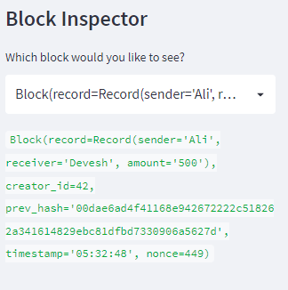

# PyChain-Ledger
Challenge / Project from Fintech Bootcamp for Blockchain Week

### About:
This is a a Streamlit Web App to demonstrate how you can create your own "Blockchain" 

### How to Run:


```shell
git clone https://github.com/salmankhaliq22/18-PyChain-Ledger.git
cd 18-PyChain-Ledger
streamlit run pychain.py
```

### Screenshots:

*Streamlit Webapp*

This is the screenshot of the whole web application


*Streamlit Webapp: Block Inspector*

This Feature tesst the PyChain Ledger by storing Records and displaying them in the dropdown for inspection

Location of UI Element: *Left Hand Column: Top Section*





*Streamlit Webapp: Validate Chain*

This Feature tests the validity of the PyChain Ledger

Location of UI Element: *Right Hand Column: Bottom Section*


